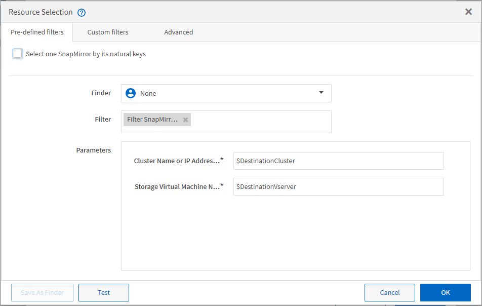

= Come funziona la selezione delle risorse
:allow-uri-read: 
:icons: font
:imagesdir: ../media/

[role="lead"]
OnCommand Workflow Automation (Wfa) utilizza algoritmi di ricerca per selezionare le risorse di storage per l'esecuzione del workflow. È necessario comprendere il funzionamento della selezione delle risorse per progettare i flussi di lavoro in modo efficiente.

WFA seleziona le risorse di voce del dizionario, ad esempio unità vFiler, aggregati e macchine virtuali, utilizzando algoritmi di ricerca. Le risorse selezionate vengono quindi utilizzate per l'esecuzione del flusso di lavoro. Gli algoritmi di ricerca WFA fanno parte degli elementi di base di WFA e includono strumenti di ricerca e filtri. Per individuare e selezionare le risorse richieste, gli algoritmi di ricerca ricercano i dati memorizzati nella cache da diversi repository, ad esempio Active IQ Unified Manager, VMware vCenter Server e un database. Per impostazione predefinita, è disponibile un filtro per ogni voce del dizionario per la ricerca di una risorsa in base alle sue chiavi naturali.

È necessario definire i criteri di selezione delle risorse per ciascun comando nel flusso di lavoro. Inoltre, è possibile utilizzare un Finder per definire i criteri di selezione delle risorse in ogni riga del flusso di lavoro. Ad esempio, quando si crea un volume che richiede una quantità specifica di spazio di storage, è possibile utilizzare il Finder "`Find aggregate by available Capacity`" (trova aggregato per capacità disponibile) nel comando "`Create Volume`" (Crea volume), che seleziona un aggregato con una quantità specifica di spazio disponibile e crea il volume su di esso.

È possibile definire un set di regole di filtro per le risorse di immissione del dizionario, come unità vFiler, aggregati e macchine virtuali. Le regole di filtro possono contenere uno o più gruppi di regole. Una regola è costituita da un attributo di voce del dizionario, un operatore e un valore. L'attributo può anche includere gli attributi dei relativi riferimenti. Ad esempio, è possibile specificare una regola per gli aggregati come segue: Elencare tutti gli aggregati che hanno nomi che iniziano con la stringa "`aggr`" e hanno più di 5 GB di spazio disponibile. La prima regola del gruppo è l'attributo "`name`", con l'operatore "`starts-with`" e il valore "`aggr`". La seconda regola per lo stesso gruppo è l'attributo "`available_size_mb`", con l'operatore "`>`" e il valore "`5000`". È possibile definire una serie di regole di filtro insieme ai filtri pubblici. L'opzione Definisci regole filtro è disattivata se è stato selezionato un Finder. L'opzione Save as Finder (Salva come Finder) è disattivata se è stata selezionata la casella di controllo Define filter rules (Definisci regole filtro).

Oltre ai filtri e ai finder, è possibile utilizzare un comando di ricerca o definizione per cercare le risorse disponibili. Il comando search o define è l'opzione preferita rispetto ai comandi No-op. Il comando di ricerca e definizione può essere utilizzato per definire le risorse del tipo di voce del dizionario certificato e del tipo di voce del dizionario personalizzato. Il comando search o define ricerca le risorse ma non esegue alcuna azione sulla risorsa. Tuttavia, quando un Finder viene utilizzato per cercare le risorse, viene utilizzato nel contesto di un comando e le azioni definite dal comando vengono eseguite sulle risorse. Le risorse restituite da un comando di ricerca o di definizione vengono utilizzate come variabili per gli altri comandi nel flusso di lavoro.

La figura seguente mostra che per la selezione delle risorse viene utilizzato un filtro:

== Esempi di selezione delle risorse nei flussi di lavoro predefiniti

È possibile aprire i dettagli dei comandi dei seguenti flussi di lavoro predefiniti nella finestra di progettazione per comprendere come vengono utilizzate le opzioni di selezione delle risorse:

* Creare un volume NFS Data ONTAP in cluster
* Stabilire il peering dei cluster
* Rimuovere un volume Clustered Data ONTAP

