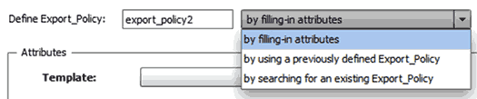

= Creare un flusso di lavoro
:allow-uri-read: 
:icons: font
:imagesdir: ../media/

[role="lead"]
È possibile utilizzare Workflow Automation (Wfa) per creare flussi di lavoro per attività come provisioning, migrazione e decommissionamento dello storage per database o file system. È necessario creare flussi di lavoro quando i flussi di lavoro WFA predefiniti non corrispondono ai propri requisiti.

.Di cosa hai bisogno
* È necessario aver compreso i concetti relativi agli elementi di base WFA.
* È necessario aver compreso le funzionalità richieste per il flusso di lavoro, come riga di ripetizione, punti di approvazione e selezione delle risorse.
* Devi aver completato la pianificazione richiesta per il tuo workflow, inclusa la checklist dei requisiti del workflow.
* È necessario creare il contenuto della guida, che fornisce informazioni sul flusso di lavoro agli operatori dello storage.

.A proposito di questa attività
La costruzione di ciascun flusso di lavoro può variare in base all'obiettivo e ai requisiti del flusso di lavoro. Questa attività non fornisce istruzioni per un flusso di lavoro specifico, ma fornisce istruzioni generali per la creazione di un flusso di lavoro.

.Fasi
. Fare clic su *Workflow Design* > *Workflow*.
. Fare clic su image:../media/new_wfa_icon.gif["Nuova icona"] sulla barra degli strumenti.
. Nella scheda *Workflow*, attenersi alla seguente procedura:
+
.. Espandere lo schema richiesto, quindi fare doppio clic su di esso image:../media/wfa_command_icon.gif["Icona del comando"] (comando) o. image:../media/wfa_workflow_icon.gif["Icona del flusso di lavoro"] (Workflow) dall'elenco *Available Steps* (passaggi disponibili).
+
È possibile ripetere questo passaggio secondo necessità. È possibile trascinare e rilasciare i passaggi per riorganizzare i passaggi nell'editor del flusso di lavoro.

.. *Opzionale:* fare clic image:../media/add_row2_wfa_icon.gif[""] per aggiungere il numero richiesto di righe, che vengono utilizzate per specificare i dettagli per l'esecuzione delle operazioni.
+
Ogni passo viene eseguito in base ai dettagli del passo specificati nella riga e nella colonna specificate. I passaggi vengono eseguiti da sinistra a destra e in ordine dall'alto verso il basso.

.. Posizionare il cursore sotto la fase aggiunta e fare clic su image:../media/add_object_wfa_icon.gif["icona dei dettagli del comando"] per aggiungere i dettagli del passo per l'esecuzione del passo, nella riga richiesta.
+
[cols="2*"]
|===
| Per questo passaggio... | Eseguire questa operazione... 

 a| 
Workflow
 a| 
Inserire i dati immessi dall'utente nella scheda *Workflow* e la condizione richiesta nella scheda *Advanced*.

 a| 
Comando
 a| 
Nella scheda parametri per <command>, fare clic su ciascuna scheda oggetto, selezionare l'opzione richiesta per definire gli attributi dell'oggetto, quindi immettere i dettagli richiesti nella scheda Avanzate e nella scheda altri parametri.

 a| 
Cercare o definire
 a| 
Selezionare l'oggetto della voce del dizionario che deve essere ricercato o definito.

|===
+
La seguente illustrazione mostra le opzioni disponibili per la definizione degli attributi dell'oggetto:

+

+
Scegliere l'azione appropriata:

+
[cols="2*"]
|===
| Per... | Eseguire questa operazione... 

 a| 
compilando gli attributi
 a| 
Inserire il valore per gli attributi utilizzando le seguenti opzioni:

*** Espressioni
*** Variabili
*** Input dell'utente
*** Selezione delle risorse
*** Naming incrementale

Posizionare il cursore sui campi degli attributi e fare clic su image:../media/elipsisicon.gif[""] per utilizzare la selezione delle risorse o le funzionalità di denominazione incrementale.

 a| 
utilizzando un definito in precedenza `_object_`
 a| 
Selezionare il definito in precedenza `object` nella casella prima dell'elenco delle opzioni.

 a| 
cercando un esistente `_object_`
 a| 
... Fare clic su *Inserisci criteri di ricerca* per cercare l'oggetto utilizzando la funzione di selezione delle risorse.
... Selezionare una delle opzioni richieste per l'esecuzione se l'oggetto richiesto non viene trovato:
+
**** Interrompere il flusso di lavoro
+
Questa opzione interrompe l'esecuzione del flusso di lavoro se l'oggetto specifico non viene trovato.

**** Disattivare questo comando
+
 This option disables only the current step and executes the workflow.
**** Attributi di compilazione per `object` ed eseguire il comando
+
 This option enables you to enter the required attributes and execute the workflow.

|===

. Se si desidera inserire un punto di approvazione, fare clic su image:../media/approval_point_hover_icon.gif["icona del punto di approvazione"] e inserire il commento richiesto per il punto di approvazione.
+
I commenti dei punti di approvazione possono includere espressioni MVEL.

. Fare clic su image:../media/repeat_row_arrow.gif[""] accanto ai numeri di riga per eseguire le seguenti operazioni:
+
** Inserire una riga.
** Copiare la riga.
** Ripetere la riga.
+
È possibile utilizzare una delle seguenti opzioni per specificare la ripetizione dei parametri del comando:

+
*** Numero di volte
+
È possibile utilizzare questa opzione per ripetere l'esecuzione del comando per il numero di ripetizioni specificato. Ad esempio, è possibile specificare che il comando "`Create qtree`" venga ripetuto tre volte per creare tre qtree.

+
È inoltre possibile utilizzare questa opzione per un numero dinamico di esecuzioni dei comandi. Ad esempio, è possibile creare una variabile di input utente per il numero di LUN da creare e utilizzare il numero specificato dall'operatore di storage quando il flusso di lavoro viene eseguito o pianificato.

*** Per ogni risorsa di un gruppo
+
È possibile utilizzare questa opzione e specificare un criterio di ricerca per un oggetto. Il comando viene ripetuto tante volte quanto l'oggetto viene restituito dai criteri di ricerca. Ad esempio, è possibile cercare i nodi in un cluster e ripetere il comando "`Create iSCSI Logical Interface`" per ciascun nodo.

** Aggiungere una condizione per l'esecuzione della riga.
** Rimuovere la riga.

. Nella scheda *Dettagli*, attenersi alla seguente procedura:
+
.. Specificare le informazioni richieste nei campi *Nome del flusso di lavoro* e *Descrizione del flusso di lavoro*.
+
Il nome e la descrizione del flusso di lavoro devono essere univoci per ogni flusso di lavoro.

.. *Opzionale:* specificare la versione dell'entità.
.. *Opzionale:* deselezionare la casella di controllo *considera elementi riservati* se non si desidera utilizzare la funzione di prenotazione.
.. *Opzionale:* deselezionare la casella di controllo *attiva convalida esistenza elemento* se non si desidera attivare la convalida per gli elementi che esistono con lo stesso nome.

. Se si desidera modificare i dati immessi dall'utente, attenersi alla seguente procedura:
+
.. Fare clic sulla scheda *User Inputs* (ingressi utente).
.. Fare doppio clic sull'input utente che si desidera modificare.
.. Nella finestra di dialogo *Modifica variabile: <user input>*, modificare l'input dell'utente.

. Se si desidera aggiungere costanti, attenersi alla seguente procedura
+
.. Fare clic sulla scheda *costanti*, quindi aggiungere le costanti richieste per il flusso di lavoro utilizzando il pulsante *Aggiungi*.
+
È possibile definire le costanti quando si utilizza un valore comune per la definizione dei parametri per più comandi. Ad esempio, vedere LA costante AGGREGATE_OVERCOMMITMENT_THRESHOLD utilizzata nel flusso di lavoro "`creazione, mappatura e protezione di LUN con SnapVault`".

.. Inserire il nome, la descrizione e il valore di ciascuna costante.

. Fare clic sulla scheda *Return Parameters* (parametri di ritorno), quindi aggiungere i parametri richiesti per il flusso di lavoro utilizzando il pulsante *Add* (Aggiungi).
+
È possibile utilizzare i parametri di ritorno quando la pianificazione e l'esecuzione del flusso di lavoro devono restituire alcuni valori calcolati o selezionati durante la pianificazione. È possibile visualizzare i valori calcolati o selezionati nella scheda Return Parameters (parametri di ritorno) della finestra di monitoraggio nell'anteprima del flusso di lavoro o al termine dell'esecuzione del flusso di lavoro.

+
Aggregato: È possibile specificare aggregato come parametro di ritorno per vedere quale aggregato è stato selezionato utilizzando la logica di selezione delle risorse.

+
Se è stato incluso un flusso di lavoro secondario nel flusso di lavoro e i nomi dei parametri restituiti dal flusso di lavoro secondario contengono uno spazio, simbolo del dollaro (in dollari), o una funzione, è necessario specificare il nome del parametro restituito tra parentesi quadre nel flusso di lavoro principale per visualizzare il valore del parametro restituito dal flusso di lavoro secondario nel flusso di lavoro principale.

+
[cols="2*"]
|===
| Se il nome del parametro è... | Specificare come... 

 a| 
`ChildWorkflow1.abc$value`
 a| 
`ChildWorkflow1["abc$"+"value"]`

 a| 
`ChildWorkflow1.$value`
 a| 
`ChildWorkflow1["$"+"value"]`

 a| 
`ChildWorkflow1.value$`
 a| 
`ChildWorkflow1.value$`

 a| 
`ChildWorkflow1.P N`
 a| 
`ChildWorkflow1["P N"]`

 a| 
`ChildWorkflow1.return_string("HW")`
 a| 
`ChildWorkflow1["return_string(\"HW\")"]`

|===
. *Opzionale:* fare clic sulla scheda *contenuto della guida* per aggiungere il file di contenuto della guida creato per il flusso di lavoro.
. Fare clic su *Preview* (Anteprima) e assicurarsi che la pianificazione del flusso di lavoro sia stata completata correttamente.
. Fare clic su *OK* per chiudere la finestra di anteprima.
. Fare clic su *Save* (Salva).

== Al termine

Testare il flusso di lavoro nell'ambiente di test, quindi contrassegnare il flusso di lavoro come pronto per la produzione in *_WorkflowName_* > *_Details_*.
